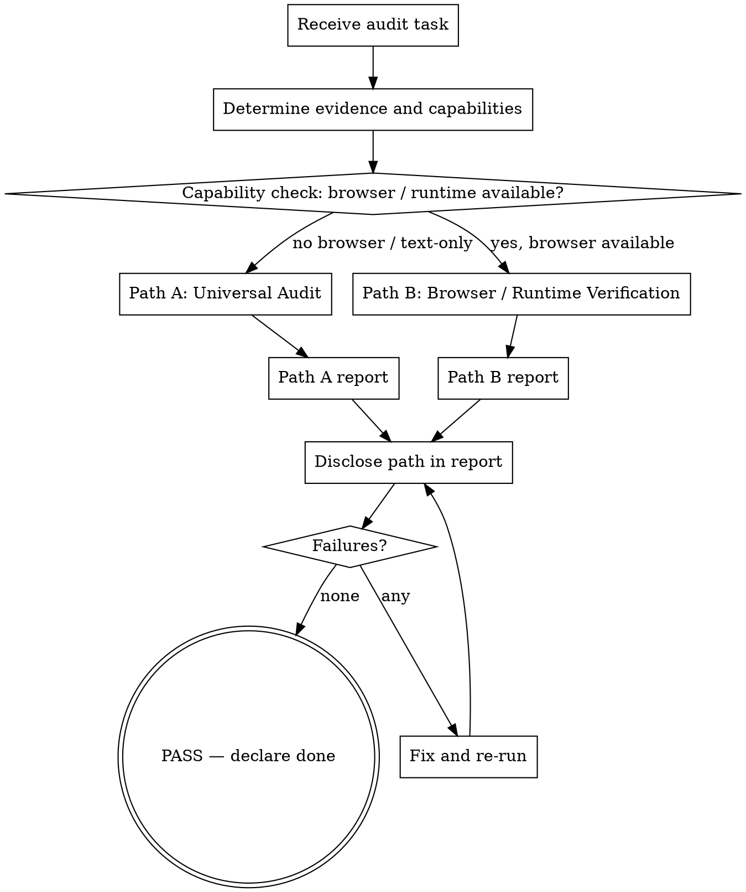

# apple-design-audit

The QA gate. Every Apple-inspired build ends here. **Two paths, capability-gated:**

- **Universal Audit (Path A)** — design reasoning, checklist, anti-pattern scan. Any agent can apply this. No browser required. Inputs may include: text description, HTML/CSS/JS source, screenshots (already-captured images), component descriptions, design tokens, or rendered images.
- **Browser / Runtime Verification (Path B)** — real rendered evidence. Optional. Requires a browser-capable environment. Tool-agnostic (Playwright, Puppeteer, Selenium, or equivalent — see `references/browser-audit.md` for the runtime adapter).

The two paths are **not** mutually exclusive. When a browser is available, both are recommended: Universal Audit (always) + Browser Verification (when the user asks for final visual QA, runtime Liquid Glass audit, or responsive regression). When no browser is available, Universal Audit still runs, and the audit report must disclose: **"Browser / runtime verification was not performed."**

The skill does not require a browser. A text-only agent can apply the 100-point checklist to a written description, a code review, or design tokens. Browser execution is a stronger evidence path, not a gating requirement.

## Core stance

> Source code is not the artifact. The rendered page in a real browser is the artifact (when a browser is available). Text descriptions and screenshots are artifacts when no browser exists.
>
> If the page looks like a default browser page, it is wrong.
> If it looks like a SaaS template, it is wrong.
> If glassmorphism is the dominant visual language, it is wrong.
> If `backdrop-filter: blur()` is the most prominent technique, it is wrong.
> If the audit checklist fails on three or more items, the build is not done.

## When to use

- After building or modifying any Apple-inspired page, section, component, or design system.
- After any redesign request ("make it more like Apple").
- After any "this doesn't feel like Apple" complaint.
- Before any "I'm done" claim.

Do **not** use when:

- The work is non-visual (data, backend, copy-only).
- The user has explicitly asked for a different design system.
- You have not built anything yet — start with apple-web-design instead.

## Audit workflow

The diagram above is the canonical workflow. The branch at "Capability check" is the only decision. The text steps below describe each path in detail.

### Path A — Universal Audit (any agent, any input)

Apply the 100-point checklist to whatever inputs are available: text description, source code, design tokens, screenshot, or partial implementation. The Path A report must include the line:

> Browser / runtime verification was not performed.

Path A must not claim: responsive behavior verified, hover verified, reduced motion verified, computed styles verified, performance verified. These claims require Path B.

### Path B — Browser / Runtime Verification (browser-capable environment)

In addition to Path A, when a browser is available:

- Serve the page locally (`python3 -m http.server`, `npx serve`, `vite preview`, etc.) so a headless browser can reach it. If the build is a component, render it inside a representative page (hero + nav + the component) — never audit a component in isolation.
- Use a headless browser (Playwright, Puppeteer, headless Chrome, Selenium, or equivalent — the tool is not a gate; the rendered evidence is). See `references/browser-audit.md` for the runtime adapter.
- Capture: Desktop light/dark at 1440x900, Mobile light/dark at 390x844, hero only, glass close-ups (if glass), hover state on the primary CTA, reduced-motion variant at 1440x900.
- Save into `./audit-screenshots/` and open them. Trust the pixels, not file sizes.
- Read computed styles (color, font, spacing, blur radius, filter chain) to confirm runtime Liquid Glass behavior.
- Measure touch targets via `getBoundingClientRect()`.
- Check horizontal overflow at every viewport.

The Path B report combines Path A and Path B findings and cites which evidence was inspected on which path. Path B is the stronger evidence path; the report is not "more correct" because it ran both, but it is more thorough.

## Step 1 — Determine evidence and capabilities (capability-gated)

Before any browser-dependent action, determine:

- **What evidence is supplied?** text description, source code (HTML/CSS/JS), screenshot, design tokens, or partial implementation.
- **What capabilities are available?** Can the agent run a browser? Take screenshots? Read computed styles? Inspect at multiple viewports?
- **What did the user ask for?** Final visual QA, runtime regression, accessibility check, or reasoning-only review?

These three answers select the path. The path is not a function of the user's request alone. The agent's capability is the deciding factor. A text-only agent always runs Path A. A browser-capable agent always runs both Path A and Path B.

| Supplied evidence | Capability | Audit path |
|---|---|---|
| text / source / design tokens / screenshot | text-only | **Path A** (Universal Audit) |
| rendered output or any of the above | browser-capable | **Path B** (Universal Audit + browser adapter) |

The remaining steps are organized by path. Skip the steps that do not apply to the path you selected.

## Step 2 — Run the Apple-likeness checklist (both paths)

Apply the 100-point checklist below to whatever inputs are available. The Path A audit covers:

- hierarchy
- typography (size, line-height, tracking, weight, font fallback)
- spacing and rhythm (modular scale, content width, section padding)
- composition (hero focal point, section variety, mobile-first)
- component consistency (button radius, cards, lists, sheets)
- brand preservation (anti-pattern #20)
- Apple Template Syndrome (anti-pattern #21)
- Liquid Glass misuse (anti-pattern #6, #22, #24, #25, #26)
- accessibility reasoning (markup, ARIA, intent) — without runtime tooling
- platform appropriateness (does this belong on Web at all, or is native more appropriate?)
- applicable anti-patterns from the 26-entry library

The Path A report must include the line:

> Browser / runtime verification was not performed.

Path A must not claim: responsive behavior verified, hover verified, reduced motion verified, computed styles verified, performance verified. These claims require Path B.

## Step 3 — Browser / Runtime Verification (Path B only)

When a browser is available:

- Serve the page locally (`python3 -m http.server`, `npx serve`, `vite preview`, etc.) so a headless browser can reach it. If the build is a component, render it inside a representative page (hero + nav + the component) — never audit a component in isolation.
- Use a headless browser (Playwright, Puppeteer, headless Chrome, Selenium, or equivalent — the tool is not a gate; the rendered evidence is). See `references/browser-audit.md` for the runtime adapter.
- Capture: Desktop light/dark at 1440x900, Mobile light/dark at 390x844, hero only, glass close-ups (if glass), hover state on the primary CTA, reduced-motion variant at 1440x900.
- Save into `./audit-screenshots/` and open them. Trust the pixels, not file sizes.
- Read computed styles (color, font, spacing, blur radius, filter chain) to confirm runtime Liquid Glass behavior.
- Measure touch targets via `getBoundingClientRect()`.
- Check horizontal overflow at every viewport.

The Path B report combines Path A and Path B findings and cites which evidence was inspected on which path. Path B is the stronger evidence path; the report is not "more correct" because it ran both, but it is more thorough.

## Step 4 — Anti-pattern scan

Run the explicit anti-pattern detection. Each anti-pattern present forces a fix.

See `references/anti-patterns.md` for full descriptions. Quick scan:

| # | Anti-pattern | Detector |
|---|---|---|
| 1 | SaaS purple-blue gradient | grep CSS for `#6..-#..-#..`, `linear-gradient(...purple, ...blue)` |
| 2 | Bento everything | count of rounded cards in section view > 6 with internal grid |
| 3 | Card everywhere | most content blocks wrapped in `.card` |
| 4 | Pill everywhere | all buttons `border-radius: 9999px` |
| 5 | Glass everywhere | >3 persistent backdrop-filter surfaces |
| 6 | Blur = Liquid Glass | glass surface is `blur + white + border` only, no other dimensions |
| 7 | Giant empty space | section > 80vh with < 5% content density |
| 8 | Excessive rounded corners | every element radius ≥ 20 px |
| 9 | Random glow | box-shadow with bright color / large blur |
| 10 | Icon bubble everywhere | most icons wrapped in tinted circle |
| 11 | Generic dashboard hero | left headline + right dashboard mockup |
| 12 | Every section looks the same | 3+ consecutive "title + 3 cards" |
| 13 | Excessive scroll animation | > 4 elements fading up on scroll |
| 14 | Tiny gray text | body text < 16 px or opacity < 0.6 |
| 15 | Glass-on-glass | translucent layer over translucent layer |
| 16 | Fake Apple navbar | logo placeholder that looks like Apple's logo / brand |
| 17 | Copying Apple instead of understanding | page uses Apple's copy, product names, photography |
| 18 | Desktop-only design | mobile screenshot reveals broken layout |
| 19 | Performance-heavy glass | >5 persistent backdrop-filter, no fallback |
| 20 | Brand Erasure | existing brand color/typography/voice replaced by Apple defaults |
| 21 | Apple Template Syndrome | output converges to centered-headline + image + compare + footer template across products |
| 22 | Fake Optical Physics | decorative SVG displacement, fake lens flare, or static "specular" without real light model |
| 23 | CJK Typography Blindness | SF Pro tracking / weight / line-height rules applied to Chinese / Japanese / Korean text |
| 24 | Invisible Glass | glass over flat backdrop with no refraction visibility, or text contrast below 4.5:1 |
| 25 | Mobile-Only-Forgotten Touch Targets | 15+ interactive elements below 44×44 px on mobile |
| 26 | Distortion Theater | exaggerated displacement scale (≥ 10 px) or chromatic aberration producing water/jelly effect |

## Step 5 — Performance check

Even if visuals pass, performance gates the build.

- Lighthouse mobile run on the served page:
  - Performance ≥ 80
  - LCP < 2.5 s on simulated 4G
  - CLS < 0.1
  - No more than 3 persistent backdrop-filter surfaces
- Shader Glass (Level 3): tested on a low-end profile, paused on idle/hidden.
- Confirm `prefers-reduced-motion` and `prefers-reduced-transparency` fallbacks.

## Step 6 — Fix loop

For each failing item:

1. Identify the smallest fix that addresses the failure.
2. Apply the fix.
3. Re-capture the affected screenshot.
4. Re-score.
5. Repeat until ≥ 70 / 100 and zero critical anti-patterns.

Do not stop after one pass. Do not declare done with a partial pass.

## Step 7 — Final report

Produce a final report with:

- Checklist score (X / 100).
- Anti-pattern hits.
- Performance metrics.
- File list of changed / added files.
- Screenshots attached or linked.
- Known limitations.
- Future improvements.

## Hard rules

- Real rendered evidence when available; honest disclosure when not. When a browser is available, the audit must produce real rendered evidence (screenshots, computed styles). When no browser is available, the audit must apply the 100-point checklist to the available inputs and disclose the missing path. "Should look fine" based on source review is acceptable when the path is disclosed.
- Light + dark + mobile in every audit.
- Reduced-motion variant verified in the screenshots.
- If a glass surface is `blur + white + border` only with no other Liquid Glass dimensions, mark `FAKE LIQUID GLASS / FROSTED GLASS ONLY` and fix or remove.
- ≥ 70 / 100 to declare done. Below that, keep iterating.
- Zero critical anti-patterns (1, 5, 6, 15, 16, 20, 24, 25) required.

## Companion references

- `references/anti-patterns.md` — full anti-pattern library with detection guidance.
- `references/screenshot-script.md` — Playwright / Puppeteer recipes for capture.
- `references/perf-checklist.md` — Lighthouse + manual perf budget.

This skill is the gate. The pack is not done until this skill says it is.
