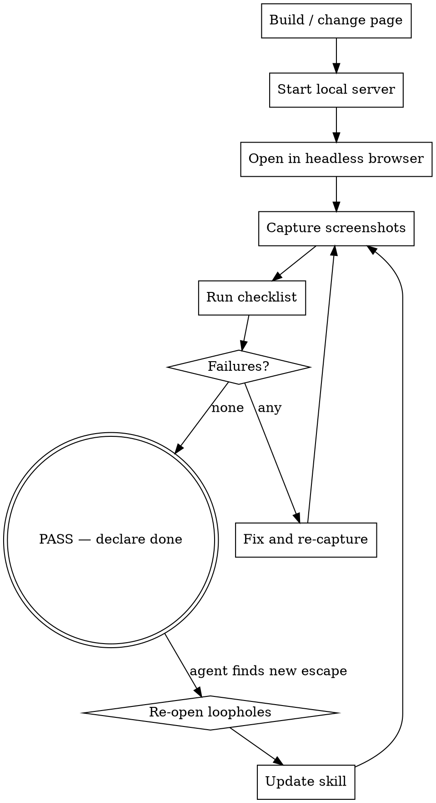

# apple-design-audit

The QA gate. Every Apple-inspired build ends here, **with a real browser**, not a code review.

## Core stance

> Source code is not the artifact. The rendered page in a real browser is the artifact.
>
> If the page looks like a default browser page, it is wrong.
> If it looks like a SaaS template, it is wrong.
> If glassmorphism is the dominant visual language, it is wrong.
> If `backdrop-filter: blur()` is the most prominent technique, it is wrong.
> If the audit checklist fails on three or more items, the build is not done.

## When to use

- After building or modifying any Apple-inspired page, section, component, or design system.
- After any redesign request ("make it more like Apple").
- After any "this doesn't feel like Apple" complaint.
- Before any "I'm done" claim.

Do **not** use when:

- The work is non-visual (data, backend, copy-only).
- The user has explicitly asked for a different design system.
- You have not built anything yet — start with apple-web-design instead.

## Audit workflow

## Step 1 — Start the build under a real server

- Serve the page locally (`python3 -m http.server`, `npx serve`, `vite preview`, etc.).
- The page must run on `http://127.0.0.1:<port>` so a headless browser can reach it.
- If the build is a component, render it inside a representative page (hero + nav + the component) — never audit a component in isolation.

## Step 2 — Capture screenshots

Use a headless browser (Playwright, Puppeteer, headless Chrome via `--screenshot`). Capture:

- **Desktop light**, viewport 1440 × 900 — full page.
- **Desktop dark**, viewport 1440 × 900 — full page.
- **Mobile light**, viewport 390 × 844 (iPhone-ish) — full page.
- **Mobile dark**, viewport 390 × 844 — full page.
- **Hero only** (first viewport) at desktop and mobile.
- **Glass surface close-ups** — if the design has glass, capture it over light bg, dark bg, and imagery.
- **Hover state** on the primary CTA and on a floating control (if any).
- **Reduced-motion variant** — toggle `prefers-reduced-motion: reduce` and capture the same hero.

Save into `./audit-screenshots/` and **open them**. Do not trust the file sizes or the absence of error logs; trust the pixels.

## Step 3 — Run the Apple-likeness checklist

Score each item 0/1/2. **Total ≥ 70 / 100** to pass. Items below 2 force a fix loop.

### A. Typography (20 points)

- [ ] Body text 17–19 px desktop / 16–17 px mobile, never smaller. (4)
- [ ] Display headlines ≥ 48 px mobile / ≥ 72 px desktop. (3)
- [ ] Line-height tightens with size (display 1.05–1.12, body 1.45+). (3)
- [ ] Tracking: negative on display, neutral on body, positive on small uppercase. (3)
- [ ] No browser-default typography, no Times New Roman / Arial fallback feel. (3)
- [ ] Hierarchy created by size + weight, not by greying out secondary text. (2)
- [ ] Body measure ≤ 75 characters. (2)

### B. Spacing (15 points)

- [ ] One modular spacing scale (4 or 8 px base), no random values. (3)
- [ ] Section padding varies (not mechanical repetition). (3)
- [ ] Hero has ≥ 12 vh air above headline. (2)
- [ ] Optical alignment (button text not visually off-center). (2)
- [ ] No giant empty space section with no content. (3)
- [ ] Horizontal gutters clamp(20px, 4vw, 48px). (2)

### C. Geometry (10 points)

- [ ] Concentric corners (outer > inner radius on nested elements). (3)
- [ ] Button radius varies (not always pill). (2)
- [ ] No uniform `border-radius: 24px` on everything. (3)
- [ ] Edge-to-edge media where appropriate. (2)

### D. Color (15 points)

- [ ] Off-white background in light mode (not pure `#FFFFFF`). (3)
- [ ] Near-black text (not pure `#000`). (3)
- [ ] Single accent color used semantically, not decoratively. (3)
- [ ] Dark mode is a first-class theme, not afterthought. (3)
- [ ] Body text contrast passes WCAG AA. (3)

### E. Components (15 points)

- [ ] One primary CTA per region (not three competing). (3)
- [ ] Cards used for content, not decoration. (3)
- [ ] Icon buttons have aria-labels. (2)
- [ ] Tap targets ≥ 44×44 px on mobile. (2)
- [ ] No icon-bubble on every icon. (2)
- [ ] No eyebrow uppercase tag on every title. (3)

### F. Glass / Liquid Glass (15 points)

- [ ] Glass is on the interaction layer, not the content layer. (3)
- [ ] No glass-on-glass stacking. (3)
- [ ] Glass surfaces have a solid fallback for `prefers-reduced-transparency`. (2)
- [ ] Glass surfaces have dark and light variants. (2)
- [ ] Glass is not the dominant visual language (used for floating controls only). (3)
- [ ] If `backdrop-filter: blur()` is the most prominent technique, the surface fails Liquid Glass — flag as `FAKE LIQUID GLASS / FROSTED GLASS ONLY`. (2)

### G. Motion (10 points)

- [ ] All transitions ≤ 500 ms for routine state changes. (2)
- [ ] Animations target `transform` / `opacity` only (with surface exceptions). (2)
- [ ] State changes are continuous, not snap. (2)
- [ ] Reveal-on-scroll ≤ 24 px, max once per section. (1)
- [ ] At most one pinned scroll sequence per page. (1)
- [ ] `prefers-reduced-motion` works (verify in screenshot). (2)

### H. Composition (10 points)

- [ ] First viewport answers what / look-at / do without scrolling. (3)
- [ ] Hero has one focal point. (2)
- [ ] At least 4 distinct section types on long pages. (3)
- [ ] Mobile is a redesign, not a shrink. (2)

## Step 4 — Anti-pattern scan

Run the explicit anti-pattern detection. Each anti-pattern present forces a fix.

See `references/anti-patterns.md` for full descriptions. Quick scan:

| # | Anti-pattern | Detector |
|---|---|---|
| 1 | SaaS purple-blue gradient | grep CSS for `#6..-#..-#..`, `linear-gradient(...purple, ...blue)` |
| 2 | Bento everything | count of rounded cards in section view > 6 with internal grid |
| 3 | Card everywhere | most content blocks wrapped in `.card` |
| 4 | Pill everywhere | all buttons `border-radius: 9999px` |
| 5 | Glass everywhere | >3 persistent backdrop-filter surfaces |
| 6 | Blur = Liquid Glass | glass surface is `blur + white + border` only, no other dimensions |
| 7 | Giant empty space | section > 80vh with < 5% content density |
| 8 | Excessive rounded corners | every element radius ≥ 20 px |
| 9 | Random glow | box-shadow with bright color / large blur |
| 10 | Icon bubble everywhere | most icons wrapped in tinted circle |
| 11 | Generic dashboard hero | left headline + right dashboard mockup |
| 12 | Every section looks the same | 3+ consecutive "title + 3 cards" |
| 13 | Excessive scroll animation | > 4 elements fading up on scroll |
| 14 | Tiny gray text | body text < 16 px or opacity < 0.6 |
| 15 | Low contrast glass | text on glass < 4.5:1 over worst-case background |
| 16 | Glass-on-glass | translucent layer over translucent layer |
| 17 | Fake Apple navbar | logo placeholder that looks like Apple's logo / brand |
| 18 | Copying Apple instead of understanding | page uses Apple's copy, product names, photography |
| 19 | Desktop-only design | mobile screenshot reveals broken layout |
| 20 | Performance-heavy glass | >5 persistent backdrop-filter, no fallback |

## Step 5 — Performance check

Even if visuals pass, performance gates the build.

- Lighthouse mobile run on the served page:
  - Performance ≥ 80
  - LCP < 2.5 s on simulated 4G
  - CLS < 0.1
  - No more than 3 persistent backdrop-filter surfaces
- Shader Glass (Level 3): tested on a low-end profile, paused on idle/hidden.
- Confirm `prefers-reduced-motion` and `prefers-reduced-transparency` fallbacks.

## Step 6 — Fix loop

For each failing item:

1. Identify the smallest fix that addresses the failure.
2. Apply the fix.
3. Re-capture the affected screenshot.
4. Re-score.
5. Repeat until ≥ 70 / 100 and zero critical anti-patterns.

Do not stop after one pass. Do not declare done with a partial pass.

## Step 7 — Final report

Produce a final report with:

- Checklist score (X / 100).
- Anti-pattern hits.
- Performance metrics.
- File list of changed / added files.
- Screenshots attached or linked.
- Known limitations.
- Future improvements.

## Hard rules

- Real browser screenshots, not CSS review. No "should look fine".
- Light + dark + mobile in every audit.
- Reduced-motion variant verified in the screenshots.
- If a glass surface is `blur + white + border` only with no other Liquid Glass dimensions, mark `FAKE LIQUID GLASS / FROSTED GLASS ONLY` and fix or remove.
- ≥ 70 / 100 to declare done. Below that, keep iterating.
- Zero critical anti-patterns (1, 5, 6, 15, 16, 18, 21, 25, 26) required.

## Companion references

- `references/anti-patterns.md` — full anti-pattern library with detection guidance.
- `references/screenshot-script.md` — Playwright / Puppeteer recipes for capture.
- `references/perf-checklist.md` — Lighthouse + manual perf budget.

This skill is the gate. The pack is not done until this skill says it is.
