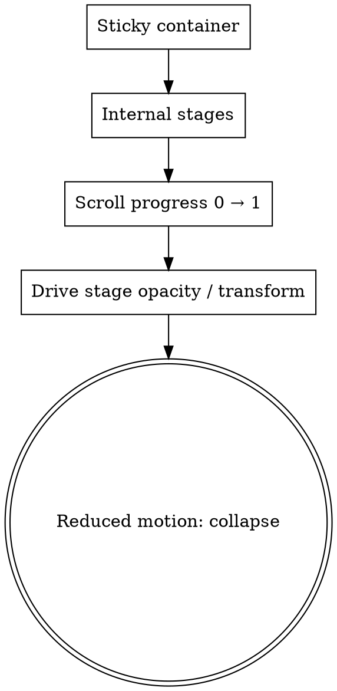

# Scroll Storytelling Reference

Extended recipes for Apple-inspired scroll-driven composition. Builds on `apple-web-composition/SKILL.md`.

Scroll storytelling is one of the most overused and least Apple-like patterns when done wrong. Use it **once per page**, and only when it earns its cost.

## When scroll storytelling works

- A product reveals itself across a sequence (assembling, rotating, color-shifting).
- A feature is best shown in stages (e.g. "before → during → after").
- A narrative requires continuity (a scene being painted across multiple steps).

## When it doesn't work

- Multiple pinned sections on one page.
- Reveal-everything on scroll (every paragraph fades up).
- Continuous scroll-jacking where the user's scroll feels hijacked.
- Scroll storytelling on every feature.
- Scroll storytelling on a page without strong imagery or 3D content.

## Architecture



A sticky container of `100vh` holds multiple stages. The user's scroll position (0 → 1 across the stage's height) drives the stage's opacity, transform, or content.

## Implementation

### Pure CSS with `animation-timeline: scroll()` (modern browsers)

```css
.sticky-stage {
  height: 300vh;  /* total scroll distance for the sequence */
}

.sticky-stage .stage {
  position: sticky;
  top: 0;
  height: 100vh;
  display: grid;
  place-items: center;
}

.sticky-stage .stage .visual {
  animation: rotate 1s linear;
  animation-timeline: scroll(root);
  animation-range: 0 300vh;  /* matches the stage's scroll distance */
}

@keyframes rotate {
  from { transform: rotate(0); }
  to   { transform: rotate(360deg); }
}
```

Limited browser support (Chrome 115+, partial Firefox/Safari). Provide JS fallback.

### JS with IntersectionObserver + scroll position

```js
const stage = document.querySelector(".sticky-stage");
const visuals = document.querySelectorAll(".sticky-stage .visual");

const update = () => {
  const rect = stage.getBoundingClientRect();
  const viewport = window.innerHeight;
  // Progress 0 → 1 as stage scrolls past
  const progress = Math.max(0, Math.min(1, -rect.top / (rect.height - viewport)));

  visuals.forEach((visual, i) => {
    const stageStart = i / visuals.length;
    const stageEnd = (i + 1) / visuals.length;
    const stageProgress = Math.max(0, Math.min(1, (progress - stageStart) / (stageEnd - stageStart)));
    visual.style.opacity = stageProgress > 0 && stageProgress < 1 ? 1 : 0;
    visual.style.transform = `scale(${0.8 + stageProgress * 0.2})`;
  });
};

window.addEventListener("scroll", update, { passive: true });
update();
```

### With a library

Framer Motion's `useScroll` + `useTransform`:

```js
const { scrollYProgress } = useScroll({
  target: stageRef,
  offset: ["start start", "end end"]
});

const rotate = useTransform(scrollYProgress, [0, 1], [0, 360]);
const opacity = useTransform(scrollYProgress, [0, 0.1, 0.9, 1], [0, 1, 1, 0]);

<motion.div style={{ rotate, opacity }}>
  {/* visual */}
</motion.div>
```

## Reduced motion

```css
@media (prefers-reduced-motion: reduce) {
  .sticky-stage { height: auto !important; }
  .sticky-stage .stage {
    position: static !important;
    height: auto !important;
    min-height: 50vh;
    margin-bottom: 16px;
  }
  .sticky-stage .visual {
    animation: none !important;
    opacity: 1 !important;
    transform: none !important;
  }
}
```

Reduced-motion users see all stages stacked, no scroll-driven sequence. They still get the content, just without the choreography.

## Performance

- The visual elements inside the sticky stage are usually images or 3D renders. Keep them small.
- Don't animate `width`, `height`, `top`, `left`, etc. Animate `transform` and `opacity` only.
- Pause animation when the stage is off-screen.
- Cap continuous animation at one stage per page.

## Common mistakes

- Pinning every section.
- Reveal-on-scroll on every paragraph.
- Scroll-jacking (preventing default scroll behavior).
- Pinned storytelling on a page without strong imagery.
- Multiple pinned sections on one page.
- Heavy continuous animation that drops frames on low-end devices.

## Anti-patterns

- Hero fades up on scroll.
- Every paragraph in every section fades up on scroll.
- Three pinned storytelling sections on one page.
- "Scroll to continue" hint that doesn't actually require scrolling.

## When to skip

If the page doesn't have a clear sequence to show, skip scroll storytelling. A page of well-composed static sections beats a poorly executed scroll-driven one.
