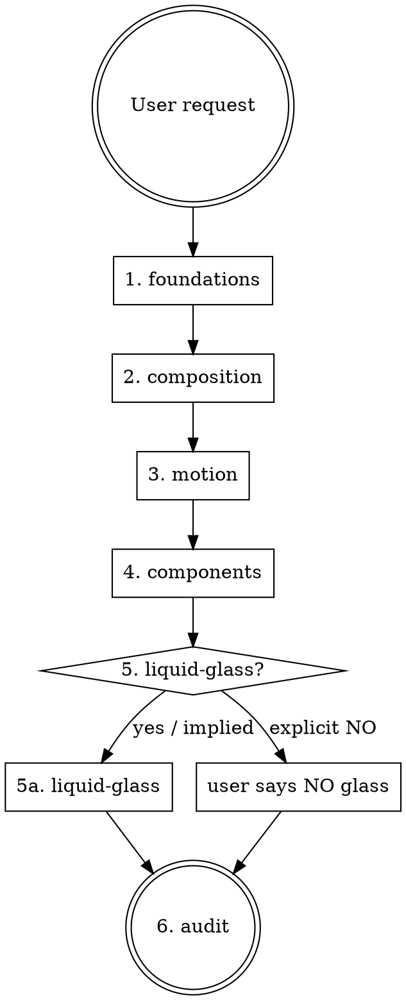

# apple-web-design

The entry point and routing skill for the Apple-inspired Web Design Skills Pack.
It does **not** define design rules itself — it tells the agent **which** skill(s) to read and **in what order**.

## Core stance

The pack targets **Apple-inspired design quality**, not Apple cloning. Always preserve the user's product brand, copy, and assets. Abstract principles (hierarchy, typography, restraint, material behavior, motion continuity) rather than copying Apple.com layouts, photography, or trademarks.

## When to use

Use when the request matches any of these symptoms:

- "做一个 Apple 风格网站 / landing page / 产品页 / Hero" (explicit "Apple")
- "把这个网站改得更像 Apple" (explicit "Apple")
- "用 Liquid Glass 做一个 navbar / 控件 / 弹层" (explicit Liquid Glass)
- "这个页面为什么不像 Apple" (explicit Apple reference)
- "做 Apple 风格的动画和交互" (explicit Apple reference)
- "模仿 Apple 官网" — translate to: extract principles, do not copy (explicit Apple reference)
- "做得像 iOS / macOS / visionOS 界面" (explicit Apple OS reference)

Do **not** use when:

- The request is for an Android Material, Fluent, brutalist, cyberpunk, or other non-Apple design language.
- The request is for an Apple-style icon, logo, or marketing illustration only.
- The user wants a 1:1 pixel clone of an Apple.com page (this is a brand/asset problem, not a design-system problem).
- The work is purely backend, data, or non-visual logic.
- The user says "make it cleaner", "make it more minimal", "make it more premium" **without any Apple reference**. Those are generic design requests. This pack is Apple-specific; using it for a brutalist or editorial site would erase the brand voice (anti-pattern #20).

## Task-to-Skill Routing Matrix

Match the request to a task family first, then load the Skills in the order shown. **Do not load a Skill for a task family that does not need it.** When in doubt, prefer fewer Skills.

### Atomic component polish

> "Make this button feel more Apple-like" / "Tighten this card" / "Fix this input"

| | Skill |
|---|---|
| **Required** | `apple-ui-components` |
| **Conditional** | `apple-design-foundations` (for tokens) |
| **Usually skip** | `apple-web-composition`, `apple-motion-interaction`, `apple-liquid-glass-web`, `apple-design-audit` (audit only on ship) |

### Navbar / toolbar / floating control

> "Redesign the navbar" / "Build a bottom tab bar" / "Make the toolbar feel Apple"

| | Skill |
|---|---|
| **Required** | `apple-ui-components` |
| **Conditional** | `apple-liquid-glass-web` (if glass is in play), `apple-motion-interaction` (if transitions matter) |
| **Usually skip** | `apple-web-composition`, `apple-design-audit` (audit on ship) |

### Landing / product / marketing page

> "Build a product launch page" / "Redesign the marketing site" / "Make the hero impactful"

| | Skill |
|---|---|
| **Required** | `apple-design-foundations`, `apple-web-composition` |
| **Conditional** | `apple-ui-components` (if interactive), `apple-motion-interaction` (if animation matters), `apple-liquid-glass-web` (only if glass is requested) |
| **Usually skip** | full `apple-design-audit` until ready to ship |

### Dense productivity / dashboard / data UI

> "Apple-inspired analytics page" / "Build an admin panel" / "Tool UI"

| | Skill |
|---|---|
| **Required** | `apple-design-foundations`, `apple-ui-components`, `apple-web-composition` |
| **Conditional** | `apple-motion-interaction` (for subtle state transitions) |
| **Usually skip** | `apple-liquid-glass-web` (data surfaces are solid), huge hero patterns, oversized CTAs |

See `apple-web-composition` for the **Tool / Workspace** and **Data / Dashboard** archetypes added in v1.1.

### Chinese / Japanese / Korean product

> "中文产品介绍页" / "做一个中文 Apple 风格页面" / "Mixed CJK + English product page"

| | Skill |
|---|---|
| **Required** | `apple-design-foundations` |
| **Conditional** | `apple-design-foundations/references/cjk-typography.md` (load when Chinese/Japanese/Korean text is present), `apple-web-composition` (if marketing page), `apple-ui-components` (if interactive) |
| **Usually skip** | `apple-liquid-glass-web` (CJK over glass needs extra care; load only on request) |

CJK numeric values (font-weight 500, line-height 1.30) are **starting heuristics for PingFang SC**, not universal rules. See `apple-design-foundations/references/cjk-typography.md`.

### Existing-brand redesign (preserve identity)

> "Make Spotify Apple-quality" / "Polish our brand site" / "Redesign without losing our identity"

| | Skill |
|---|---|
| **Required** | `apple-design-foundations` |
| **Must preserve** | brand colors, brand typography, brand voice |
| **Conditional** | `apple-web-composition` (if page-level), `apple-ui-components` (if components), `apple-motion-interaction` (if motion matters) |
| **Forbidden** | erase brand color in favor of Apple defaults; replace brand typography with SF Pro; Apple-template clone |

See `apple-design-audit/references/anti-patterns.md` #20 Brand Erasure.

### Explicit Liquid Glass task

> "Add Liquid Glass to the navbar" / "Use the iOS 26 glass material" / "Make the segmented control glassy"

| | Skill |
|---|---|
| **Required** | `apple-liquid-glass-web` |
| **Conditional** | `apple-ui-components` (for the surface structure), `apple-motion-interaction` (for morphing indicators) |
| **Usually skip** | `apple-web-composition` (unless glass is part of a hero), `apple-design-foundations` beyond color/contrast reference |

**Refraction requires optical information.** Glass over a flat color backdrop is invisible. If the design lacks contrast or content beneath the glass, skip glass or change the backdrop.

### Audit-only task

> "Audit this page" / "Check Apple-likeness" / "Review before ship"

| | Skill |
|---|---|
| **Required** | `apple-design-audit` |
| **Conditional** | browser execution adapter (Tier 2 reference) when a browser is available |
| **Usually skip** | full composition, motion, and Liquid Glass skills unless the audit flags a specific problem |

A text-only agent can apply the audit's 100-point checklist on a written description. Browser screenshots are an optional enhancement.

## Routing order when multiple families match

If the request combines families (e.g. "Apple-inspired Chinese dashboard with Liquid Glass"), load in this order:

1. `apple-design-foundations` (always first)
2. CJK reference if applicable
3. Task-specific Skills in the matrix above
4. `apple-design-audit` (always last, before ship)

**Do not load** Skills outside the task family. The pack's biggest waste is over-routing: loading Liquid Glass for a button polish, or composition for a single widget.

## Routing — read these skills in order

Read in this sequence. Skip a step only when the task explicitly excludes it.

1. **apple-design-foundations** — always read first. Sets typography, space, geometry, color, depth rules. Every visual decision downstream uses these.
2. **apple-web-composition** — for any landing page, marketing page, product page, dense UI, or sectioned long page. Defines hero, section rhythm, narrative pacing.
3. **apple-motion-interaction** — for any interactive page or component with state changes. Spring, continuity, reduced motion.
4. **apple-ui-components** — for any page with navigation, controls, forms, lists, sheets, popovers.
5. **apple-liquid-glass-web** — only if the request mentions Liquid Glass, glass surfaces, translucency, floating controls, or you have decided the design needs an interaction-layer material. Most product pages do **not** need glass.
6. **apple-design-audit** — always run last. Browser screenshots, audit checklist, fix loop.

## Hard rules (apply to the whole pack)

These never bend, regardless of which sub-skill is in use.

- **Content first.** No UI element exists to demonstrate a visual technique. Remove a control, badge, pill, or gradient if it does not serve the content.
- **Restraint.** If a sentence in the design doc could be replaced by "remove it" and the page improves, remove it.
- **No purple-blue SaaS gradient, no neon glow, no glassmorphism-as-default.** See `apple-design-audit/references/anti-patterns.md`.
- **Glass is an interaction layer, not a content layer.** Glass belongs on floating controls, toolbars, and popovers — never on body text, tables, forms, or every card.
- **Type carries hierarchy, not shadows or glass.** When in doubt, fix typography and spacing before adding visual material.
- **Motion explains spatial relationships.** Never animate purely for delight. Every transition must answer "where did this come from, where is it going."
- **Respect accessibility.** `prefers-reduced-motion`, `prefers-reduced-transparency`, sufficient contrast, focus rings, semantic structure. See `apple-motion-interaction/references/reduced-motion.md`.
- **Performance is a feature.** Every persistent `backdrop-filter` costs GPU. Shader Glass must justify its cost.
- **Brand stays the user's.** Do not borrow Apple logos, photography, product names, marketing copy, or trademarked typography claims. If the user has their own brand tokens (color, type, voice), those win over Apple defaults.

## Anti-shortcut table

If the agent (or a future agent) is tempted to skip a step, here is why each step matters:

| Temptation | Why it breaks | Read instead |
|---|---|---|
| Skip foundations, jump to glass | Glass without typography/space is "blur on a default page" | foundations |
| Skip composition, write sections | Page becomes three-card SaaS layout | composition |
| Skip motion, ship static | State changes snap, no spatial logic | motion-interaction |
| Skip components, freestyle | Inconsistent navbar/button/card grammar | ui-components |
| Skip liquid-glass, fake it | `blur + white + border` ≠ Liquid Glass | liquid-glass-web |
| Skip audit, declare done | Visual bugs ship to users | design-audit |

## Working sequence for the agent

1. Read this skill (`apple-web-design`) for routing.
2. Match the request to a task family in the routing matrix above.
3. Load the required Skills for that family. Do not load Skills in the **Usually skip** column.
4. Build the page or component.
5. Run `apple-design-audit` end-to-end with real browser screenshots (or text-only checklist if no browser is available).
6. Iterate until the audit passes. **Do not declare done on a partial pass.**

## Companion files

- `references/pack-overview.md` — one-page map of the whole pack (optional reading).
- `references/by-topic.md` — Tier 2 reference catalog. Load only when you need a specific reference by topic. The 22-row reference table moved here in v1.1.
- This skill does **not** duplicate content from the sub-skills. Read them.