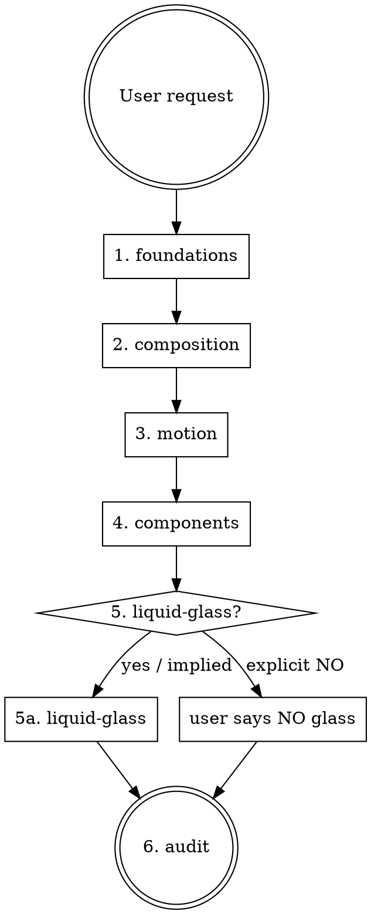

# apple-web-design

The entry point and routing skill for the Apple-inspired Web Design Skills Pack.
It does **not** define design rules itself — it tells the agent **which** skill(s) to read and **in what order**.

## Core stance

The pack targets **Apple-inspired design quality**, not Apple cloning. Always preserve the user's product brand, copy, and assets. Abstract principles (hierarchy, typography, restraint, material behavior, motion continuity) rather than copying Apple.com layouts, photography, or trademarks.

## When to use

Use when the request matches any of these symptoms:

- "做一个 Apple 风格网站 / landing page / 产品页 / Hero" (explicit "Apple")
- "把这个网站改得更像 Apple" (explicit "Apple")
- "用 Liquid Glass 做一个 navbar / 控件 / 弹层" (explicit Liquid Glass)
- "这个页面为什么不像 Apple" (explicit Apple reference)
- "做 Apple 风格的动画和交互" (explicit Apple reference)
- "模仿 Apple 官网" — translate to: extract principles, do not copy (explicit Apple reference)
- "做得像 iOS / macOS / visionOS 界面" (explicit Apple OS reference)

Do **not** use when:

- The request is for an Android Material, Fluent, brutalist, cyberpunk, or other non-Apple design language.
- The request is for an Apple-style icon, logo, or marketing illustration only.
- The user wants a 1:1 pixel clone of an Apple.com page (this is a brand/asset problem, not a design-system problem).
- The work is purely backend, data, or non-visual logic.
- The user says "make it cleaner", "make it more minimal", "make it more premium" **without any Apple reference**. Those are generic design requests. This pack is Apple-specific; using it for a brutalist or editorial site would erase the brand voice (anti-pattern #21).

## Routing — read these skills in order

Read in this sequence. Skip a step only when the task explicitly excludes it.

1. **apple-design-foundations** — always read first. Sets typography, space, geometry, color, depth rules. Every visual decision downstream uses these.
2. **apple-web-composition** — for any landing page, marketing page, product page, or sectioned long page. Defines hero, section rhythm, narrative pacing.
3. **apple-motion-interaction** — for any interactive page or component with state changes. Spring, continuity, reduced motion.
4. **apple-ui-components** — for any page with navigation, controls, forms, lists, sheets, popovers.
5. **apple-liquid-glass-web** — only if the request mentions Liquid Glass, glass surfaces, translucency, floating controls, or you have decided the design needs an interaction-layer material. Most product pages do **not** need glass.
6. **apple-design-audit** — always run last. Browser screenshots, audit checklist, fix loop.

## Hard rules (apply to the whole pack)

These never bend, regardless of which sub-skill is in use.

- **Content first.** No UI element exists to demonstrate a visual technique. Remove a control, badge, pill, or gradient if it does not serve the content.
- **Restraint.** If a sentence in the design doc could be replaced by "remove it" and the page improves, remove it.
- **No purple-blue SaaS gradient, no neon glow, no glassmorphism-as-default.** See `apple-design-audit/references/anti-patterns.md`.
- **Glass is an interaction layer, not a content layer.** Glass belongs on floating controls, toolbars, and popovers — never on body text, tables, forms, or every card.
- **Type carries hierarchy, not shadows or glass.** When in doubt, fix typography and spacing before adding visual material.
- **Motion explains spatial relationships.** Never animate purely for delight. Every transition must answer "where did this come from, where is it going."
- **Respect accessibility.** `prefers-reduced-motion`, `prefers-reduced-transparency`, sufficient contrast, focus rings, semantic structure.
- **Performance is a feature.** Every persistent `backdrop-filter` costs GPU. Shader Glass must justify its cost.
- **Brand stays the user's.** Do not borrow Apple logos, photography, product names, marketing copy, or trademarked typography claims.

## Anti-shortcut table

If the agent (or a future agent) is tempted to skip a step, here is why each step matters:

| Temptation | Why it breaks | Read instead |
|---|---|---|
| Skip foundations, jump to glass | Glass without typography/space is "blur on a default page" | foundations |
| Skip composition, write sections | Page becomes three-card SaaS layout | composition |
| Skip motion, ship static | State changes snap, no spatial logic | motion-interaction |
| Skip components, freestyle | Inconsistent navbar/button/card grammar | ui-components |
| Skip liquid-glass, fake it | `blur + white + border` ≠ Liquid Glass | liquid-glass-web |
| Skip audit, declare done | Visual bugs ship to users | design-audit |

## Working sequence for the agent

1. Read this skill (`apple-web-design`) for routing.
2. Read each skill in the order above, **fully**. Do not skim.
3. Build the page or component.
4. Run `apple-design-audit` end-to-end with real browser screenshots.
5. Iterate until the audit passes. **Do not declare done on a partial pass.**

## Companion files

- `references/pack-overview.md` — one-page map of the whole pack (optional reading).
- This skill does **not** duplicate content from the sub-skills. Read them.

## Reference discoverability

If you know what you need, jump directly:

| If you're deciding… | Read |
|---|---|
| Type scale, font stack, hierarchy | `apple-design-foundations/references/typography.md` |
| Chinese / Japanese / Korean typography | `apple-design-foundations/references/cjk-typography.md` |
| Spacing scale, grid, gutters | `apple-design-foundations/references/space-and-grid.md` |
| Radius, concentric corners, optical alignment | `apple-design-foundations/references/geometry.md` |
| Color palette, accent, dark mode, depth | `apple-design-foundations/references/color-and-depth.md` |
| Hero archetype / first viewport | `apple-web-composition/references/hero-patterns.md` |
| Section variety on a long page | `apple-web-composition/references/section-vocabulary.md` |
| Pinned / scroll-driven storytelling | `apple-web-composition/references/scroll-storytelling.md` |
| Mobile redesign (not a shrink) | `apple-web-composition/references/mobile-composition.md` |
| Spring curves, easing, animation tokens | `apple-motion-interaction/references/spring-tokens.md` |
| Reduced motion / reduced transparency | `apple-motion-interaction/references/reduced-motion.md` |
| Navbar / bottom tab bar / sidebar | `apple-ui-components/references/navigation.md` |
| Buttons (primary / secondary / tertiary / icon) | `apple-ui-components/references/buttons.md` |
| Sheet / popover / modal / drawer | `apple-ui-components/references/overlays.md` |
| Forms, inputs, validation | `apple-ui-components/references/forms.md` |
| Level 1 CSS glass | `apple-liquid-glass-web/references/css-glass.md` |
| Level 2 SVG glass (displacement + specular) | `apple-liquid-glass-web/references/svg-glass.md` |
| Level 3 shader glass | `apple-liquid-glass-web/references/shader-glass.md` |
| Text contrast on glass | `apple-liquid-glass-web/references/contrast-on-glass.md` |
| Glass performance budget | `apple-liquid-glass-web/references/performance.md` |
| Anti-pattern library (27 entries) | `apple-design-audit/references/anti-patterns.md` |
| Screenshot / capture script | `apple-design-audit/references/screenshot-script.md` |
| Lighthouse / perf checklist | `apple-design-audit/references/perf-checklist.md` |
